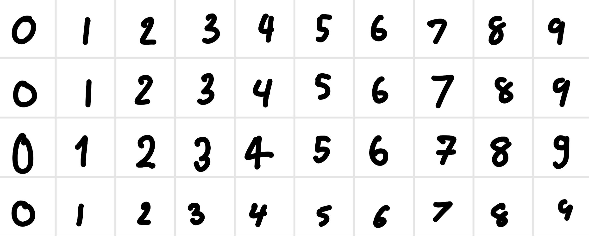

# MNIST Data Generator from Image

It is a simple data generator for MNIST dataset. The input image should exported from Goodnotes application as the example image below.

It will automatic crop the image and resize it to 28x28 and save in the data folder.